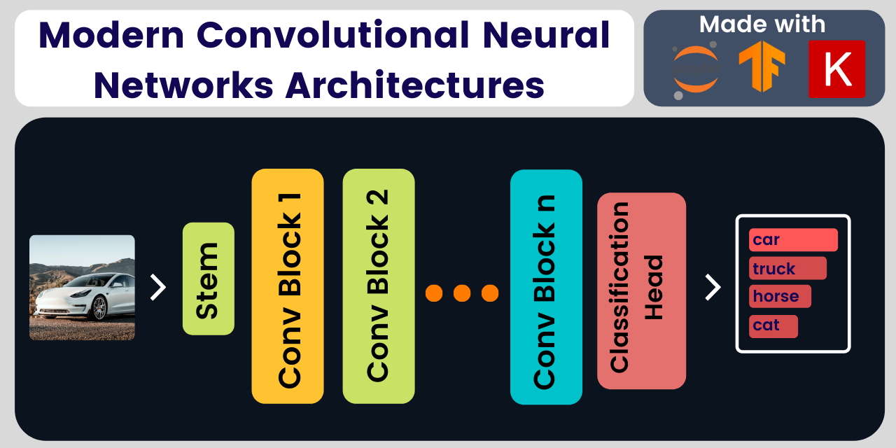

# Modern Convolutional Neural Network Architectures

<p style='text-align: justify;'> <a href="https://nbviewer.jupyter.org/github/Nyandwi/ModernConvNets"> </a> <a href="https://colab.research.google.com/github/Nyandwi/ModernConvNets" target="_parent"></a> </p>

>***Revision of the designs and implementation of Modern Convolutional Neural Network architectures***
-------



## Introduction to Convolutional Neural Networks

Convolutional Neural Networks (ConvNets or CNNs) are a class of neural networks algorithms that are mostly used in visual recognition tasks such as [image classification](https://twitter.com/Jeande_d/status/1462040682437120001), object detection, and image segmentation. The use of ConvNets in visual recognition is inarguably one of the [biggest inventions of decade 2010s in deep learning community](https://twitter.com/Jeande_d/status/1501188511281549321?s=20&t=dCZzcKKoXgvVL_8ebVDclg).

A standard ConvNet architecture is typically made of 3 main layers that are convolution, max-pooling, and fully connected layers. Convolution layers are the main component of ConvNets. They are used for extracting features in images using filters. 

Pooling layers are used for downsampling the activation or feature maps produced by convolutional layers. Downsampling can also be achieved by using strides(greater than 1) in a normal convolution layer, but max-pooling layers don't have any learnable parameters and they introduce translational invariance which improves model generalization on the cost of [spatial inductive bias](https://samiraabnar.github.io/articles/2020-05/indist). Fully connected layers are used for classification purpose(matching learned features with their respective labels). In classification settings, the last fully connected layer is typically activated with `softmax` activation function!

Example of ConvNets architectures that follow the above structure are [AlexNet](convnets/01-alexnet.ipynb) and [VGG](convnets/02-vgg.ipynb). Most modern ConvNet architectures go beyond plain stack of convolution, max-pooling and fully connected layers. For example, architectures like [ResNet](convnets/04-resnet.ipynb) and other alike networks involve residual connections.

As you go through the materials in this repository, you will learn more about those architectures and how they are implemented. For more about ConvNets, check [resources section](#further-learning)!

## ConvNet Architectures

* AlexNet - Deep Convolutional Neural Networks: [implementation](convnets/01-alexnet.ipynb), [paper](https://proceedings.neurips.cc/paper/2012/file/c399862d3b9d6b76c8436e924a68c45b-Paper.pdf)
  
* VGG - Very Deep Convolutional Networks for Large Scale Image Recognition: [implementation](convnets/02-vgg.ipynb), [paper](https://arxiv.org/pdf/1409.1556.pdf)
  
* GoogLeNet(Inceptionv1) - Going Deeper with Convolutions: [implementation](convnets/03-googlenet.ipynb), [paper](https://arxiv.org/abs/1409.4842)

* ResNet - Deep Residual Learning for Image Recognition: [implementation](convnets/04-resnet.ipynb), [annotated paper](annotated_papers/resnet.pdf) [paper](https://arxiv.org/abs/1512.03385)

* ResNeXt - Aggregated Residual Transformations for Deep Neural Networks: [implementation](convnets/06-resnext.ipynb), [annotated paper](annotated_papers/resnext.pdf), [paper](https://arxiv.org/abs/1611.05431v2)

* Xception - Deep Learning with Depthwise Separable Convolutions: [implementation](convnets/07-xception.ipynb), [annotated paper](annotated_papers/xception.pdf), [paper](https://arxiv.org/abs/1610.02357)

* DenseNet - Densely Connected Convolutional Neural Networks: [implementation](convnets/05-densenet.ipynb), [annotated paper](annotated_papers/densenet.pdf), [paper](https://arxiv.org/abs/1608.06993v5)

* MobileNetV1 - Efficient Convolutional Neural Networks for Mobile Vision Applications: [implementation](convnets/08-mobilenet.ipynb), [annotated paper](annotated_papers/mobilenet.pdf), [paper](https://arxiv.org/abs/1704.04861v1)

* MobileNetV2 - Inverted Residuals and Linear Bottlenecks: [implementation](convnets/09-mobilenetv2.ipynb) [annotated paper](annotated_papers/mobilenetv2.pdf), [paper](https://arxiv.org/abs/1801.04381)

* EfficientNet - Rethinking Model Scaling for Convolutional Neural Networks: [implementation](convnets/10-efficientnet.ipynb), [annotated paper](annotated_papers/efficientnetv1.pdf), [paper](https://arxiv.org/abs/1905.11946v5). See also [EfficientNetV2](https://arxiv.org/abs/2104.00298v3)

* RegNet - Designing Network Design Spaces: [implementation](convnets/11-regnet.ipynb), [annotated paper](annotated_papers/regnet.pdf), [paper](hhttps://arxiv.org/abs/2003.13678). See also [this](https://arxiv.org/abs/2103.06877)

* ConvMixer - Patches are All You Need?: [implementation](convnets/12-convmixer.ipynb), [annotated paper](annotated_papers/convmixer.pdf), [paper](https://openreview.net/pdf?id=TVHS5Y4dNvM).

* ConvNeXt - A ConvNet for the 2020s: [implementation](convnets/13-convnext.ipynb), [annotated paper](annotated_papers/convnexts.pdf), [paper](https://arxiv.org/abs/2201.03545)

## Choosing a ConvNet Architecture

Computer vision community is blessed with having many vision architectures that work great across many platforms or hardwares. But, having many options means it is not easy to choose an architecture that suits a given problem. How can you choose a ConvNet architecture for your problem?

The first rule of thumb is that you should not try to design your own architecture from scratch. If you are working on generic problem, it never hurts to start with ResNet-50. If you are building a mobile-based visual application where there is limited computation resources, try [MobileNets](https://arxiv.org/abs/1801.04381)(or other mobile friendly architectures like [ShuffleNetv2](https://arxiv.org/abs/1807.11164) or [ESPNetv2](https://arxiv.org/abs/1811.11431)). 

For a better trade-off between accuracy and computation efficiency, try [EfficientNet](convnets/10-efficientnet.ipynb) or latest [ConvNeXt](convnets/13-convnext.ipynb)!

That said, choosing architecture(or learning algorithm) is a no free-lunch scenario. There is no universal architecture. There is no single architecture that is guaranteed to work for all datasets and problems. It's all experimentation. It's all trying!

If you are a visionary or like to stay on the bleeding edge of the field, take a look at [vision transformers](https://paperswithcode.com/method/vision-transformer)! We don't know yet, but they might be the successor of ConvNets!


## Important Notes

The implementations of ConvNets architectures contained in this repository are not optimized for training but rather to understand how those networks were designed, principal components that makes them and how they evolved overtime. LeNet-5[(LeCunn, 1998)](http://vision.stanford.edu/cs598_spring07/papers/Lecun98.pdf) had 5 layers(with learnable weights, pooling layers excluded). AlexNet[(Krizhevsky et al., 2012)](https://proceedings.neurips.cc/paper/2012/file/c399862d3b9d6b76c8436e924a68c45b-Paper.pdf) had 8 layers. Few years later, Residual Networks[(He et al., 2015)](https://arxiv.org/abs/1512.03385) made the trends after showing that it's possible to train networks of over 100 layers. Today, residual networks are still one of the most widely used architecture across a wide range of visual tasks and they impacted the [design of language architectures](https://arxiv.org/abs/2203.00555). 

Computer vision research community is [very vibrant](https://twitter.com/Jeande_d/status/1446468370182799364).
With the intelligent frameworks and better architectures we have to day, understanding how networks architectures are designed before you can throw them in your dataset is never a neccesity, but it's one of the best ways to stay on top of this vibrant and fast-ever changing field!

If you want to use ConvNets for solving a visual recognition tasks such as image classification or object detection, you can get up running quickly by getting the models (and their pretrained weights) from tools like [Keras](https://keras.io), [TensorFlow Hub](https://tfhub.dev), [PyTorch Vision](https://github.com/pytorch/vision), [Timm PyTorch Image Models](https://github.com/rwightman/pytorch-image-models), [GluonCV](https://cv.gluon.ai), and [OpenMML Lab](https://github.com/open-mmlab).

## References Implementations

* [Keras Applications](https://github.com/keras-team/keras/tree/master/keras/applications)
* [Timm PyTorch Image Models](https://github.com/rwightman/pytorch-image-models)
* [PyTorch Vision](https://github.com/pytorch/vision)
* [Machine Learning Tokyo](https://github.com/Machine-Learning-Tokyo/CNN-Architectures)

## Further Learning

If you would like to learn more about ConvNets/CNNs, below are some few amazing resources:

* [CS231n Convolutional Neural Networks for Visual Recognition](http://cs231n.stanford.edu) - [Lecture 5](https://www.youtube.com/watch?v=bNb2fEVKeEo&list=PL3FW7Lu3i5JvHM8ljYj-zLfQRF3EO8sYv&index=5) and [Lecture 9](https://www.youtube.com/watch?v=DAOcjicFr1Y&list=PL3FW7Lu3i5JvHM8ljYj-zLfQRF3EO8sYv&index=9)

* [Deep Learning for Computer Vision ](https://www.youtube.com/playlist?list=PL5-TkQAfAZFbzxjBHtzdVCWE0Zbhomg7r) - [Lecture 8](https://www.youtube.com/watch?v=XaZIlVrIO-Q&list=PL5-TkQAfAZFbzxjBHtzdVCWE0Zbhomg7r&index=8)

* [Paper With Code - Convolutional Neural Networks](https://paperswithcode.com/methods/category/convolutional-neural-networks)

* [MIT Introduction to Deep Learning](http://introtodeeplearning.com) - [Lecture 3](https://www.youtube.com/watch?v=AjtX1N_VT9E&list=PLtBw6njQRU-rwp5__7C0oIVt26ZgjG9NI&index=4)

* [CS230 Deep Learning - CNN Cheatsheet](https://stanford.edu/~shervine/teaching/cs-230/cheatsheet-convolutional-neural-networks)

* [CNNs Interactive Explainer](https://poloclub.github.io/cnn-explainer/)

## Citation

If you use any material in this repository, you are welcome to cite it with:

```
author: Jean de Dieu Nyandwi
title: Modern Convolutional Neural Network Architectures
year: 2022
publisher: GitHub
url: https://github.com/Nyandwi/ModernConvNets
```
***************************

I had a joy learning, revising, and implementing CNN architectures. While going through the materials in this repository, I hope you will enjoy them as much as I did!

For any error, suggestion, or simply anything, you can reach out through [email](mailto:johnjw7084@gmail.com), [Twitter](https://twitter.com/Jeande_d) or [LinkedIn](https://www.linkedin.com/in/nyandwi/).

******


